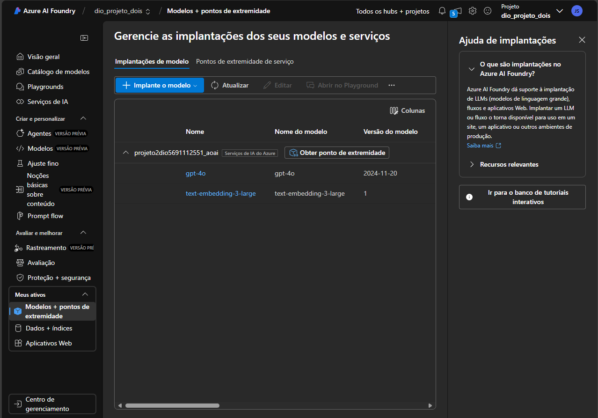
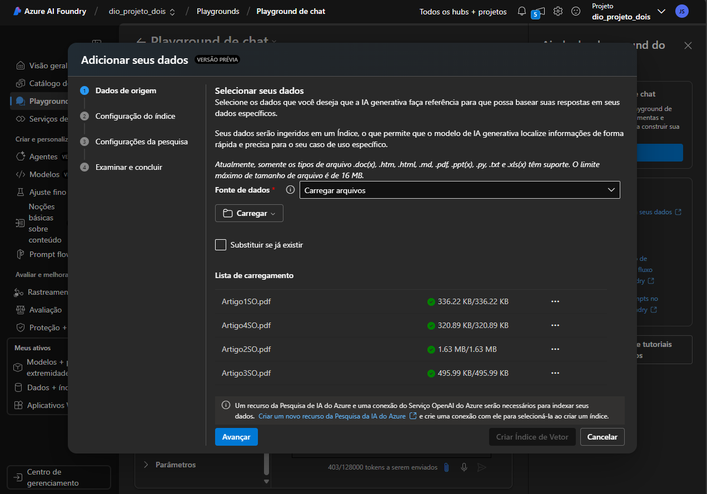
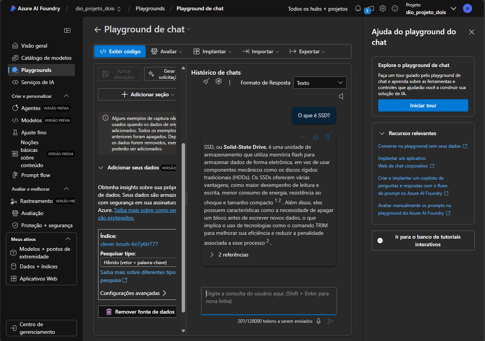

# projetoAzureML2

Este projeto se baseia no treinamento de uma Inteligência Artificial de chat 
responsivo, capaz de receber dados e emitir inputs relacionados ao conteúdo dos 
arquivos.  

O projeto pode ser subdividido em 4 partes: 

1. Criação do modelo e endpoint; 
2. Adição dos dados; 
3. Anexação de mecanismo de busca; 
4. Interação com o chat; 

## Criação do Modelo e Endpoints 
O primeiro passo foi criar o modelo, escolhendo o tipo de IA, que neste 
caso fora o gpt-4o e o text-embedding-3. 

## Adição de Dados 
Neste momento, fiz o upload dos artigos, quais tratavam da comparação de 
desempenho entre tipos de armazenamento SSD e HD. 

## Anexação de Mecanismos de Busca 
Em seguida, tive de criar um recurso de busca Azure IA Search. 

## Interação com o chat 
Por fim, interagi com o chat e atestei que as respostas estavam de acordo 
com o conteúdo dos arquivos anexados. 
